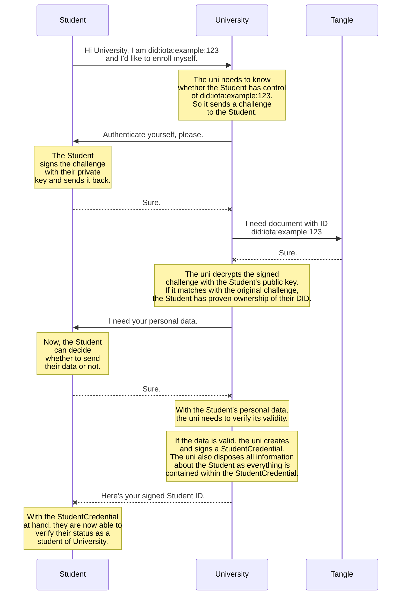
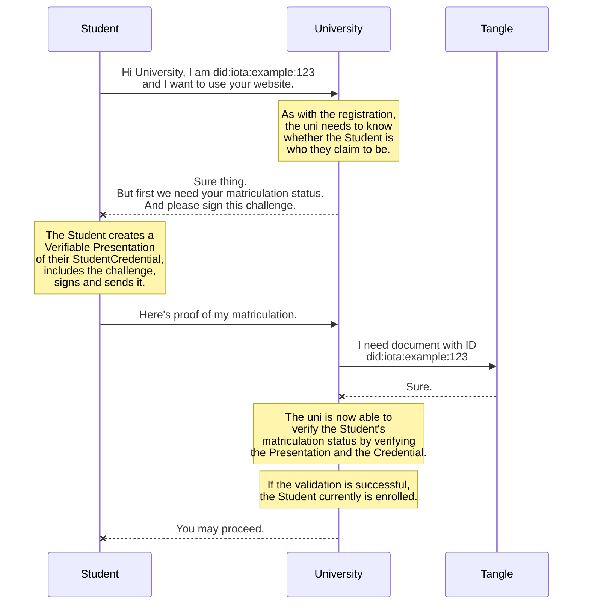
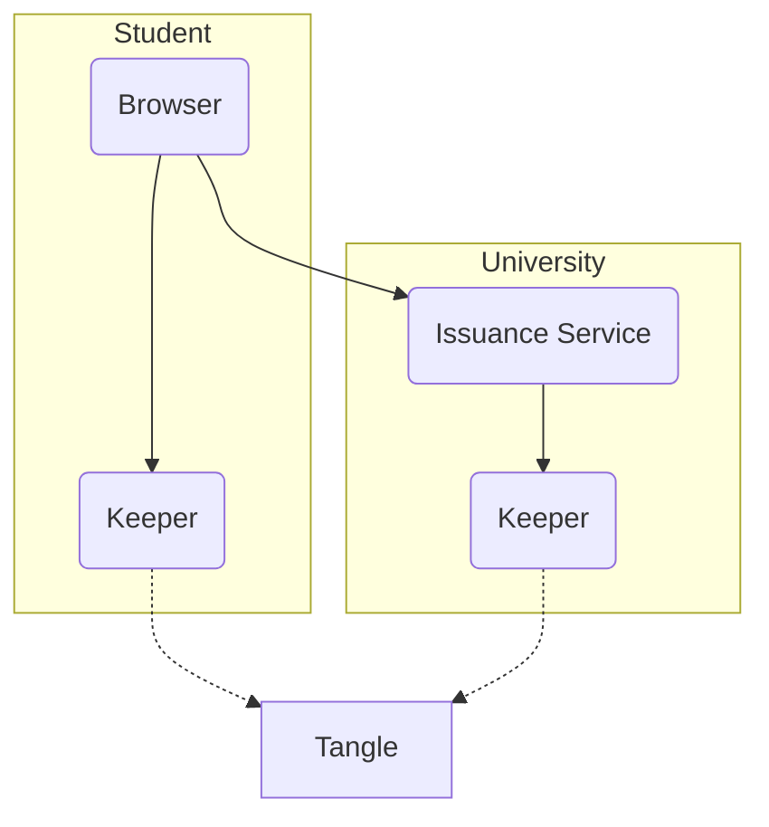
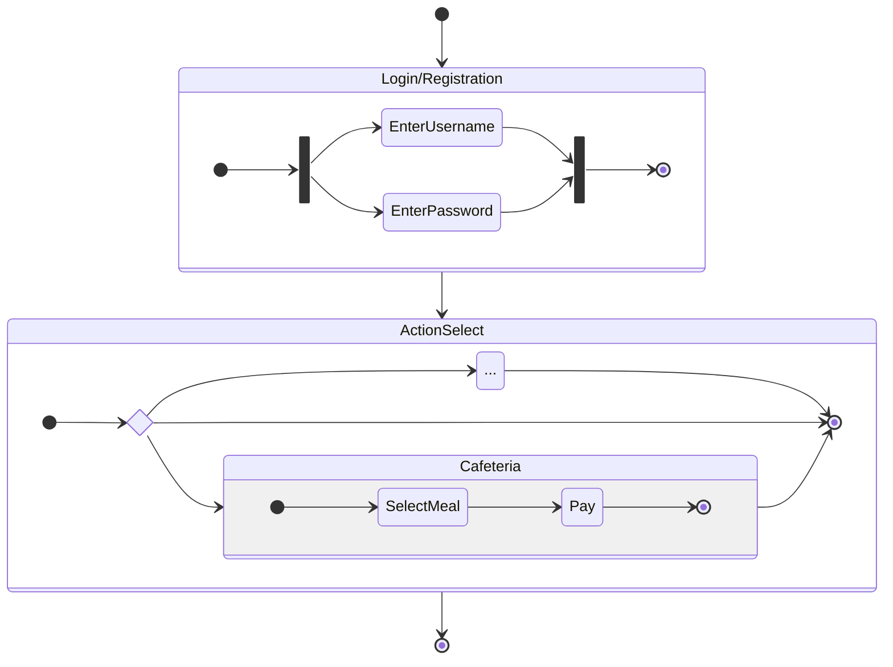

# Digital Student ID Demo <!-- omit in toc -->

Newest efforts in Digital Identity and Self Sovereign Identity (SSI) leave the hope that digital governing may come true.  
Organizations such as the [IOTA Foundation](https://www.iota.org/) are creating decentralized frameworks that make this possible. IOTA has the unique concept of the [Tangle](https://wiki.iota.org/learn/about-iota/tangle) which makes SSI possible today.  

To showcase a possible scenario where SSI would greatly benefit everyday life, this project aims to prototype a Digital Student ID for the use on a university website.

# Contents <!-- omit in toc -->

- [1. Verifiable StudentCredential](#1-verifiable-studentcredential)
  - [1.1. How it works](#11-how-it-works)
    - [1.1.1. Registration | Matriculation](#111-registration--matriculation)
    - [1.1.2. Login | Authentication](#112-login--authentication)
  - [1.2. Credential Contents](#12-credential-contents)
- [2. Design](#2-design)
  - [2.1. System Architecture](#21-system-architecture)
  - [2.2. User Navigation](#22-user-navigation)
- [3. Setting up your local environment](#3-setting-up-your-local-environment)
  - [3.1. Quick Start Guide](#31-quick-start-guide)
  - [3.2. Set up `node.js` using `nodeenv`](#32-set-up-nodejs-using-nodeenv)
    - [3.2.1. Create a virtual node environment](#321-create-a-virtual-node-environment)

# 1. Verifiable StudentCredential

## 1.1. How it works

Some high-level explanation

The following steps expect that DIDs for both, the university and the Student, already exist on the Tangle. If you want to learn more about DID creation, see the [Keeper documentation](./keeper/README.md).

### 1.1.1. Registration | Matriculation

The process of enrollment via the StudentCredential.



### 1.1.2. Login | Authentication

The process of authentication via the StudentCredential.



## 1.2. Credential Contents

The StudentCredential makes several assertions about its holder.  
For now it will contain a students personal information, which in a fully working ecosystem will not be necessary nor desirable. This will be done via official government issuers. But as such infrastructure does not exist yet, the design decision was to include personal information in the StudentCredential just for convenience.

**Personal information**

- Full name
- Address
- Picture of the student

**Study information**

- Name of the university
- Current semester
- Matriculation number
- Name of the study subject
- Degree (Bachelor | Master)

# 2. Design

## 2.1. System Architecture

The overall architecture of this framework.



## 2.2. User Navigation

The simple user navigation in the web app.



# 3. Setting up your local environment

## 3.1. Quick Start Guide

If you don't already have `node.js` installed on your system, download and install it from [here](https://nodejs.org/). 

Next, after cloning/downloading the repository, open 3 different terminal sessions and and navigate to the following paths in one terminal each:
- `/university`
- `/keeper`
- `/gisa-did`

Now go ahead and execute the following command in each of the terminals:
```shell
npm install
```

Finally, in the `/university` and `/keeper` teminals, execute
```shell
npm run dev
```
while in the `/gisa-did` terminal, execute
```shell
npm start
```
On [localhost:4200](https://localhost:4200/) you should now have the fully functional web app running with the backend servers running as well.

## 3.2. Set up `node.js` using `nodeenv`

You can always go ahead and install `node.js` globally on your system from [here](https://nodejs.org/).  
The following steps will only guide you through the process of creating a virtual environment for `node.js` using `nodeenv`.

### 3.2.1. Create a virtual node environment

> **IMPORTANT** This will require Python version 3 or greater and `pip` installed on your system.

First, open a shell inside the repo's root directory, then install the `node.js` environment manager `nodeenv` using `pip`.

```shell
pip install nodeenv
```

Now create an environment called `.node`.  
For this environment, we will use `node.js` version `18.12.1`.
Your command line will need elevated privileges for this to work.

```shell
nodeenv .node --node=18.12.1
```

<details><summary><b>Good to know</b>: Node.js versions that are known not to work:</summary>

<table>
  <tr>
		<td>Version</td>
    <td>Incompatibility</td>
	</tr>
	<tr>
		<td><code>18.8.0</code></td>
    <td>some problems with <a href="https://www.npmjs.com/package/@iota/identity-wasm">@iota/identity-wasm@0.6.0</a></td>
	</tr>
</table>

</details>
