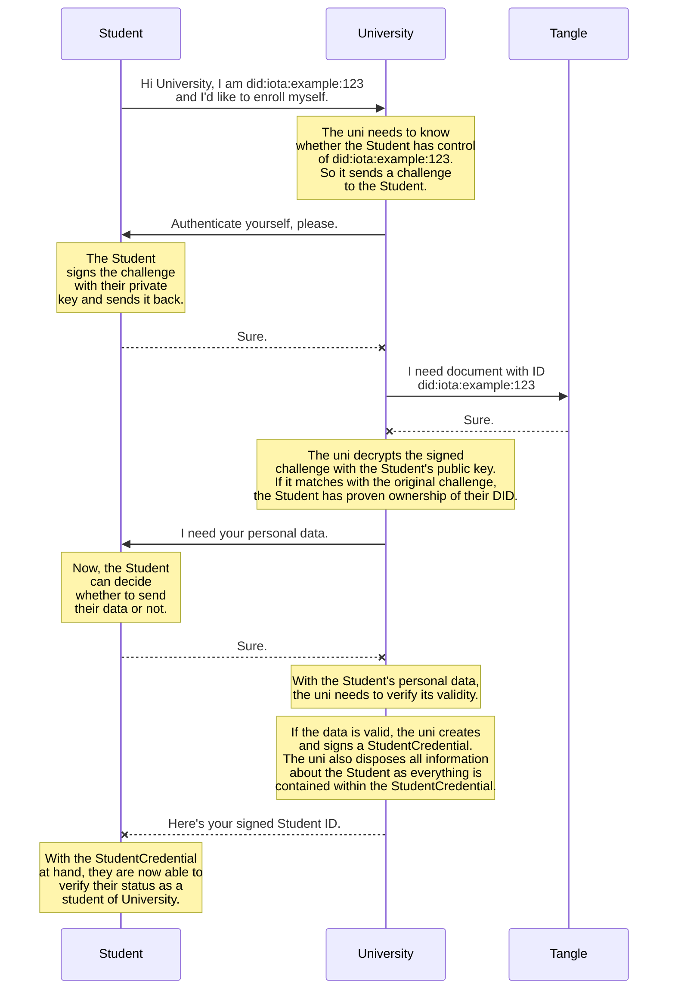
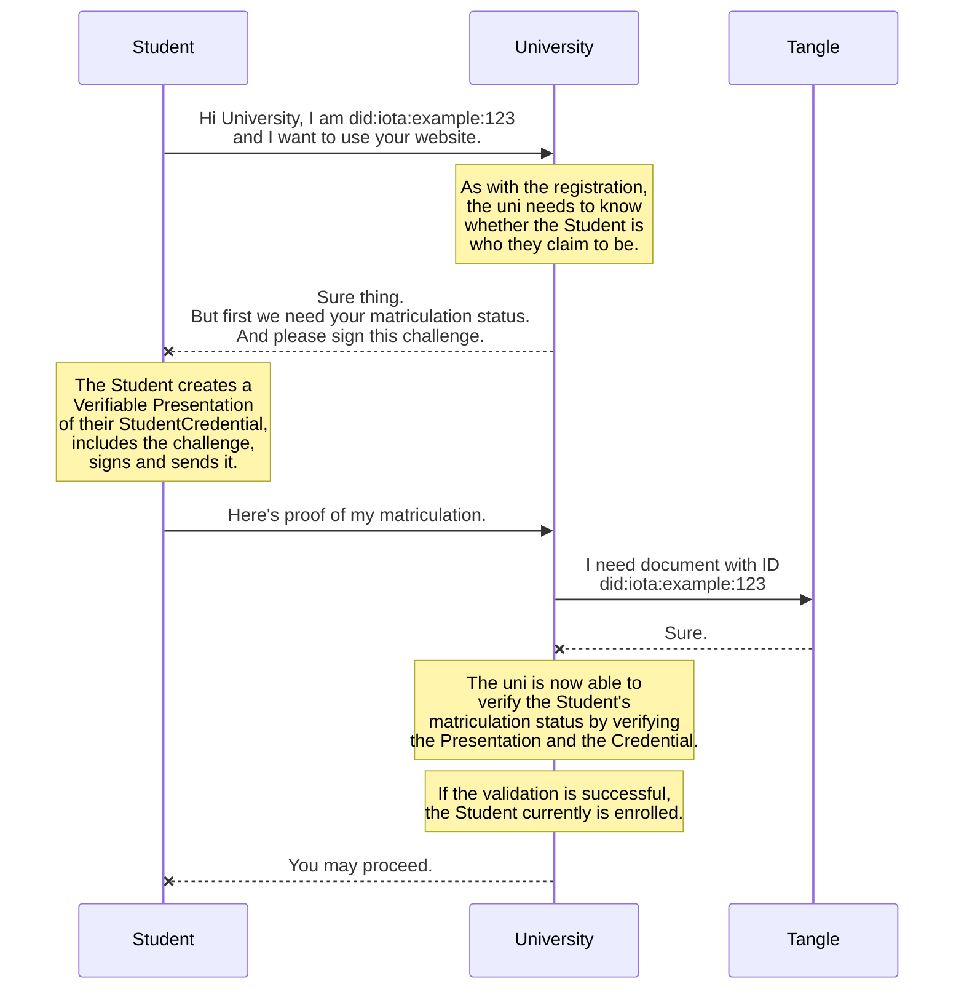

# Digital Student ID Demo <!-- omit in toc -->

Newest efforts in Digital Identity and Self Sovereign Identity (SSI) leave the hope that digital governing may come true.  
Organizations such as the [IOTA Foundation](https://www.iota.org/) are creating decentralized frameworks that make this possible. IOTA has the unique concept of the [Tangle](https://wiki.iota.org/learn/about-iota/tangle) which makes SSI possible today.  

To showcase a possible scenario where SSI would greatly benefit everyday life, this project aims to prototype a Digital Student ID for the use on a university website.

- [1. Verifiable Student Credential](#1-verifiable-student-credential)
  - [1.1. How it works](#11-how-it-works)
    - [1.1.1. Registration | Matriculation](#111-registration--matriculation)
    - [1.1.2. Login | Authentication](#112-login--authentication)
  - [1.2. Contents](#12-contents)
  - [1.3. User Navigation](#13-user-navigation)
- [2. Setting up your environment](#2-setting-up-your-environment)
  - [2.1. Set up `node.js` using `nodeenv`](#21-set-up-nodejs-using-nodeenv)
    - [2.1.1. Create a virtual node environment](#211-create-a-virtual-node-environment)

# 1. Verifiable Student Credential

## 1.1. How it works

**Precondition:** Identities for both, the university and the Student, already exist on the Tangle.

### 1.1.1. Registration | Matriculation



### 1.1.2. Login | Authentication



## 1.2. Contents

The Student Credential makes several assertions about its holder.  
For now it will contain a students personal information, which in a fully working ecosystem will not be necessary or desirable. This will be done via official government issuers. But as such infrastructure does not exist yet, the design decision was to include personal information in the Student Credential just for convenience.

**Personal information**

- Full name
- Address
- Picture of the student

**Study information**

- University name
- Current semester
- Matriculation number
- Subject
  - Name
  - Degree

## 1.3. User Navigation


# 2. Setting up your environment

## 2.1. Set up `node.js` using `nodeenv`

You can always go ahead and install `node.js` globally on your system from [here](https://nodejs.org/).  
The following steps will only guide you through the process of creating a virtual environment for `node.js` using `nodeenv`.

### 2.1.1. Create a virtual node environment

> **IMPORTANT** This will require Python version 3 or greater and `pip` installed on your system.

First, open a shell inside the repo's root directory, then install the `node.js` environment manager `nodeenv` using `pip`.

```shell
pip install nodeenv
```

Now create an environment called `.node`.  
For this environment, we will use `node.js` version `18.12.1`.
Your command line will need elevated privileges for this to work.

```shell
nodeenv .node --node=18.12.1
```

<details><summary><b>Good to know</b>: Node.js versions that will not work correctly</summary>
- 18.8.0 some problems with <a href="https://www.npmjs.com/package/@iota/identity-wasm">@iota/identity-wasm@0.6.0"</a>
</details>
