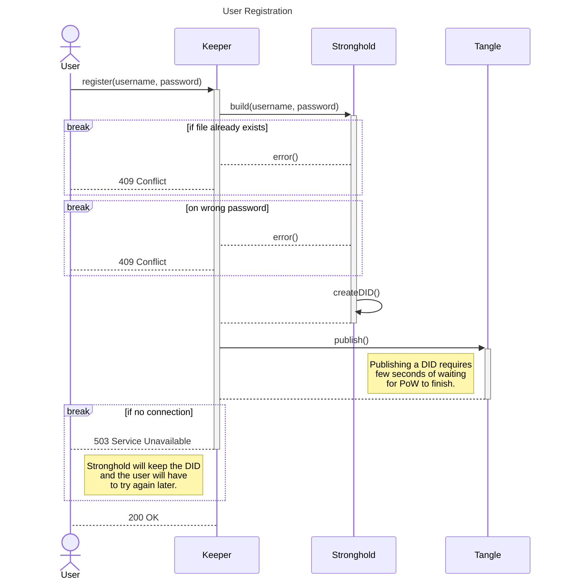
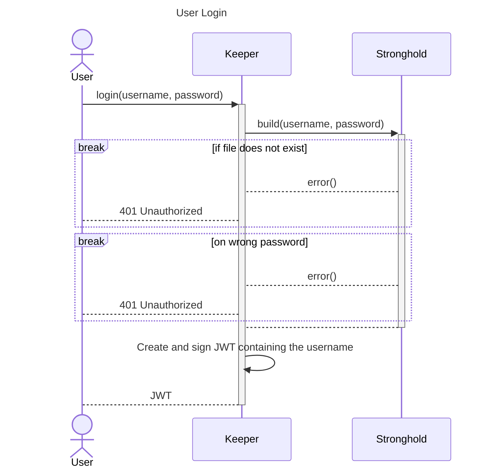
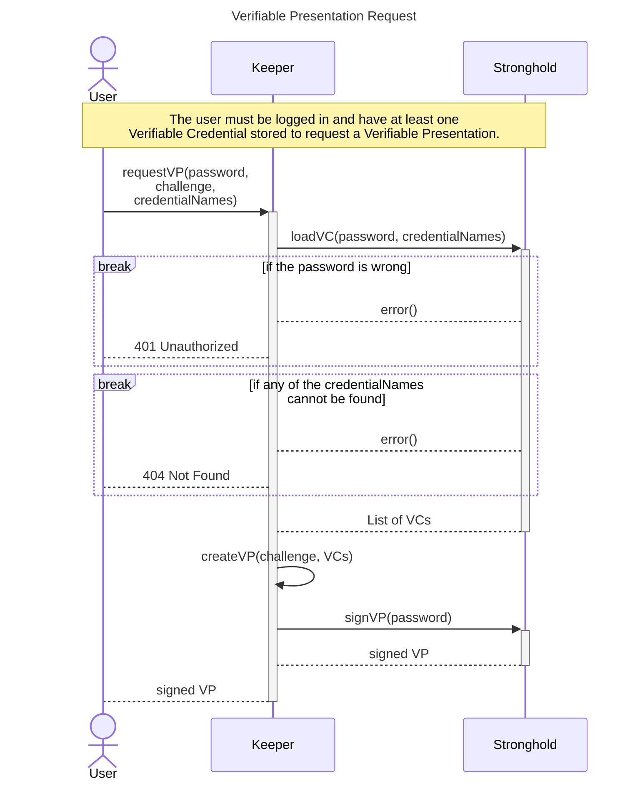

# keeper

*keeper* is a RESTful DID management software designed to run on local hardware.
It uses the IOTA Stronghold framework to securely store DID private keys.

Another app may use *keeper*'s REST API to create a DID by providing a username and a password. 
The username is used to identify the Stronghold file while the password is used to encrypt it.

*keeper* also provides the ability to store credentials and create Verifiable Presentations from them.

