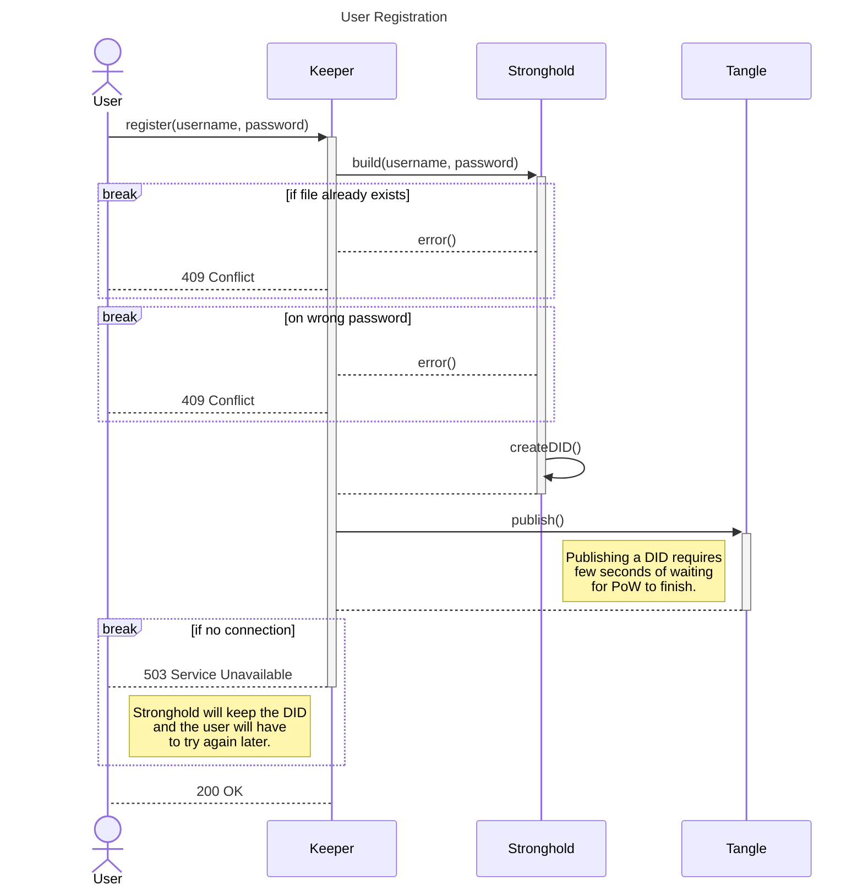
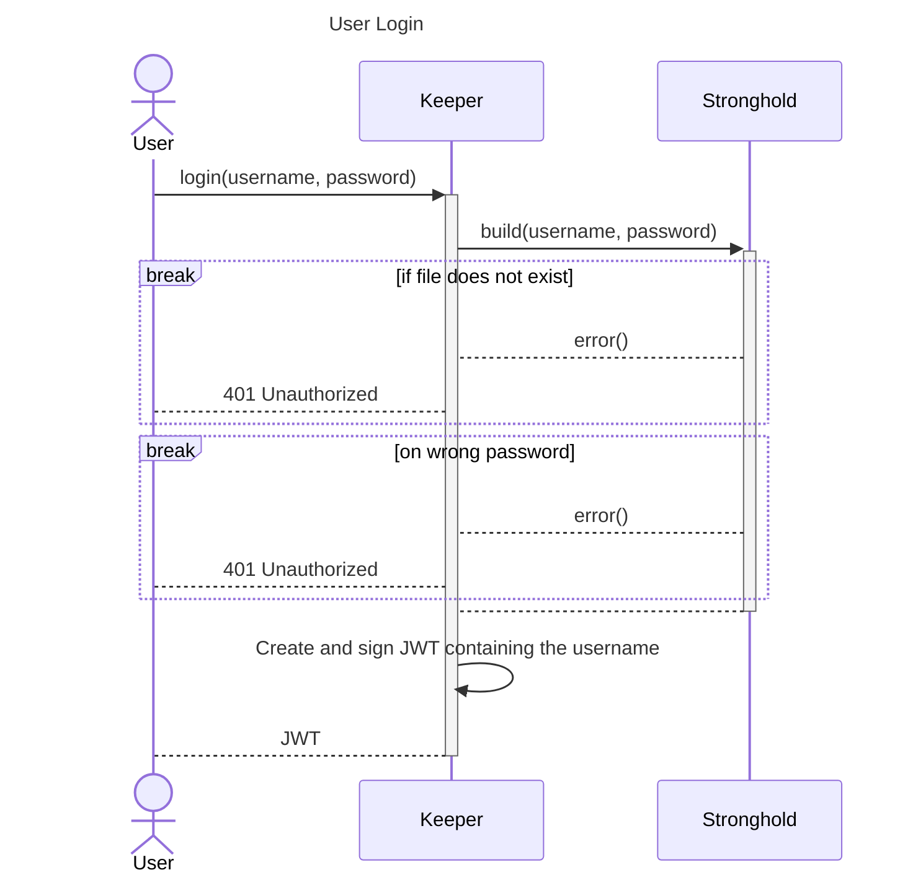
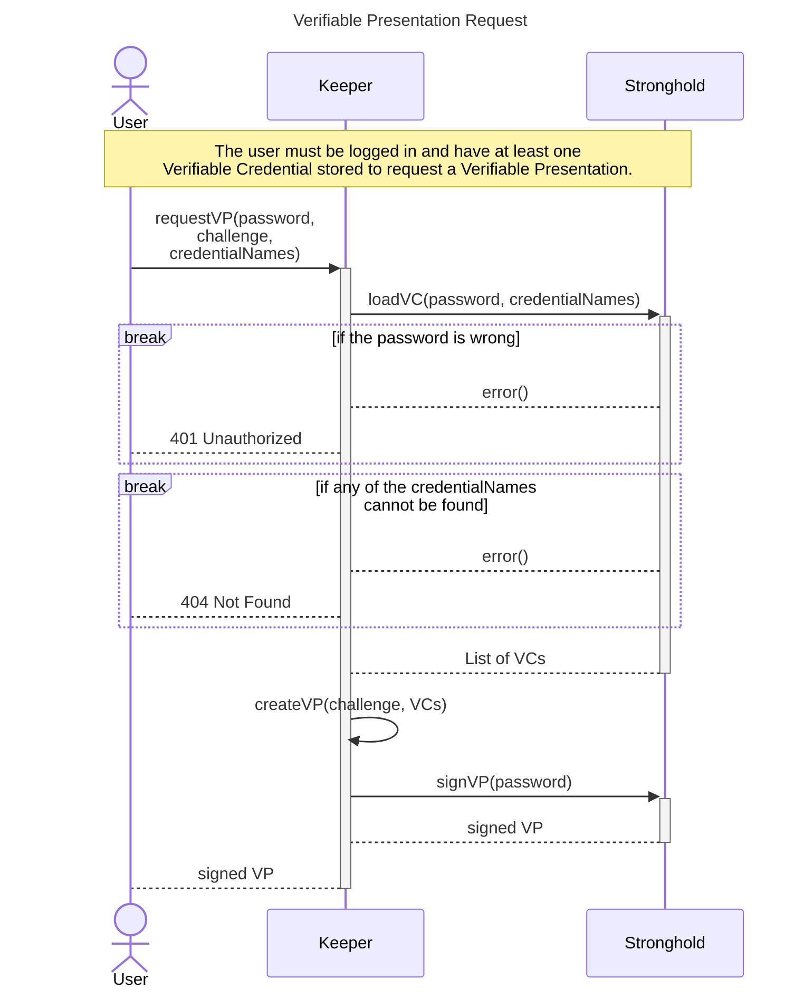

# Keeper <!-- omit in toc -->

*Keeper* is a RESTful wallet for DIDs and Verifiable Credentials designed to run on local hardware, enabling third party software to securely interact with local DIDs, create Verifiable Presentations and so on just by providing a username and a password. It uses IOTA Stronghold under the hood, which handles all private keys.

## Content <!-- omit in toc -->

- [1. User Registration](#1-user-registration)
- [2. User Login](#2-user-login)
- [3. Verifiable Presentation Request](#3-verifiable-presentation-request)

# 1. User Registration

# 2. User Login

# 3. Verifiable Presentation Request

