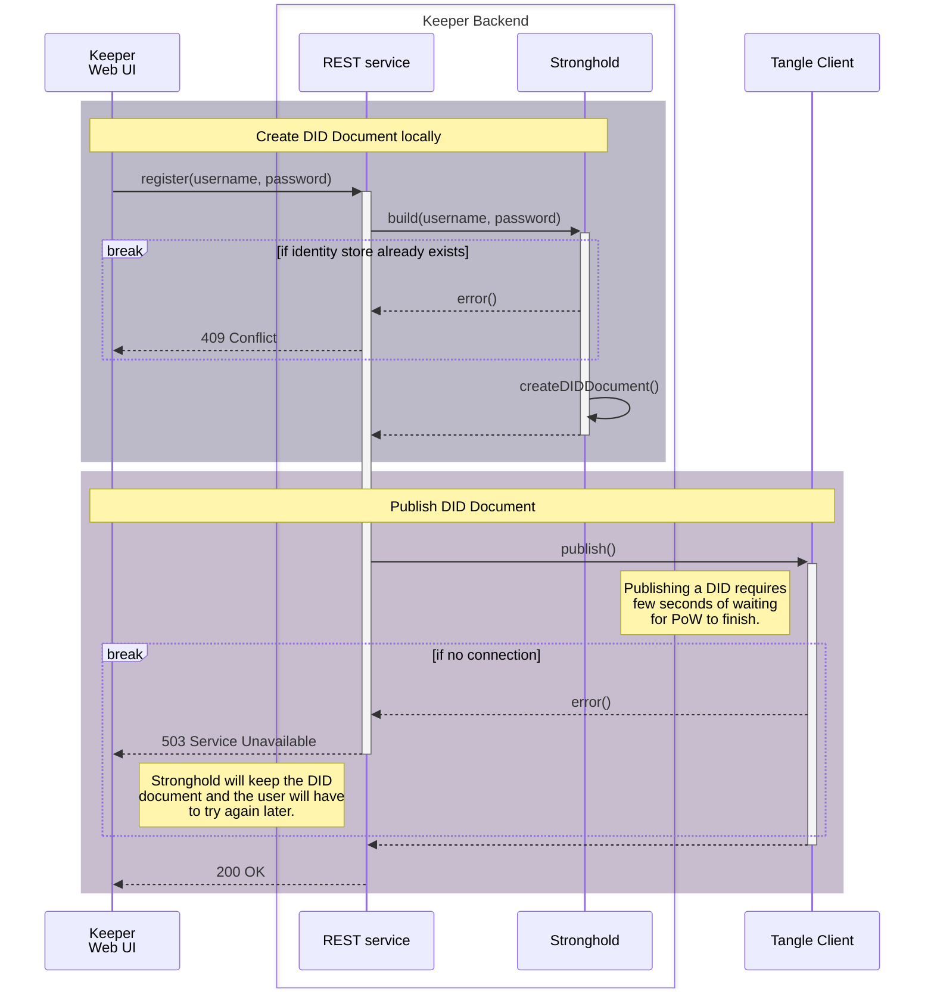
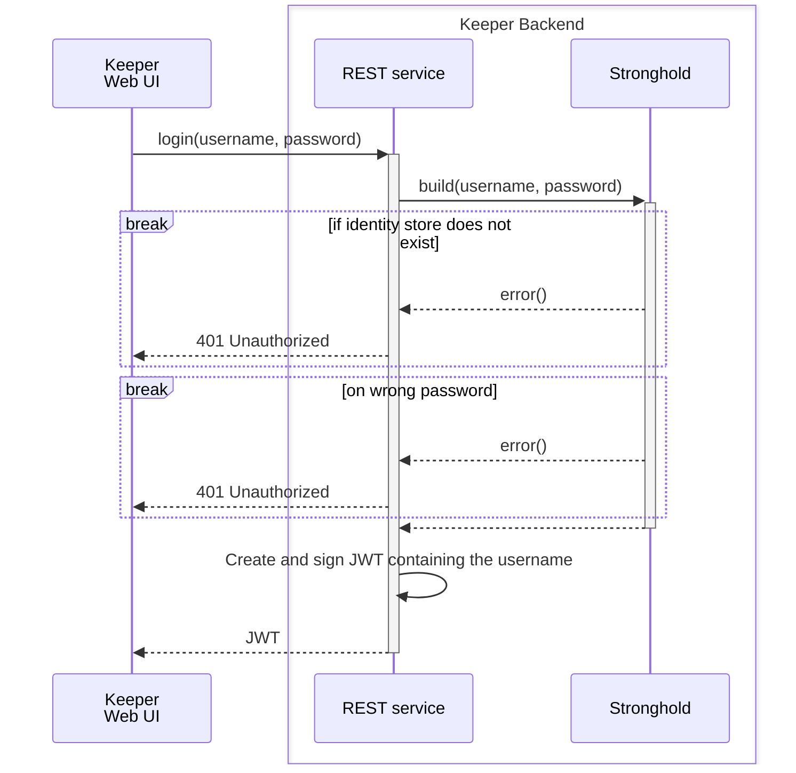
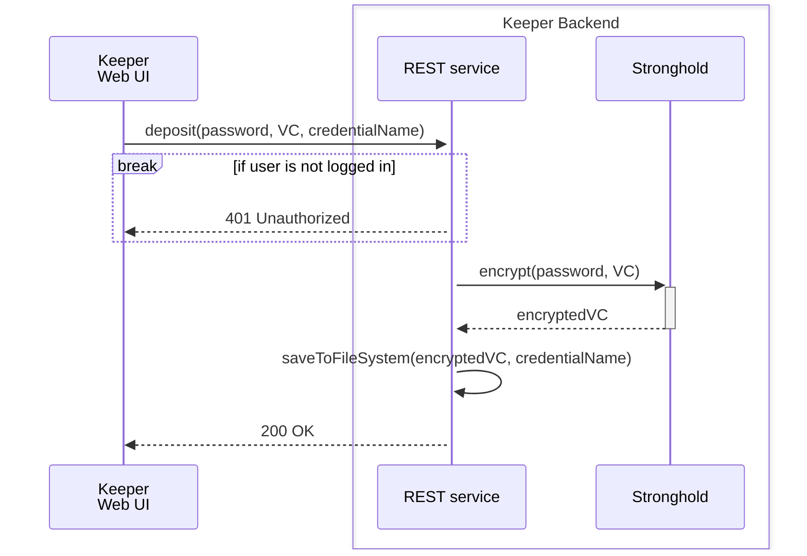
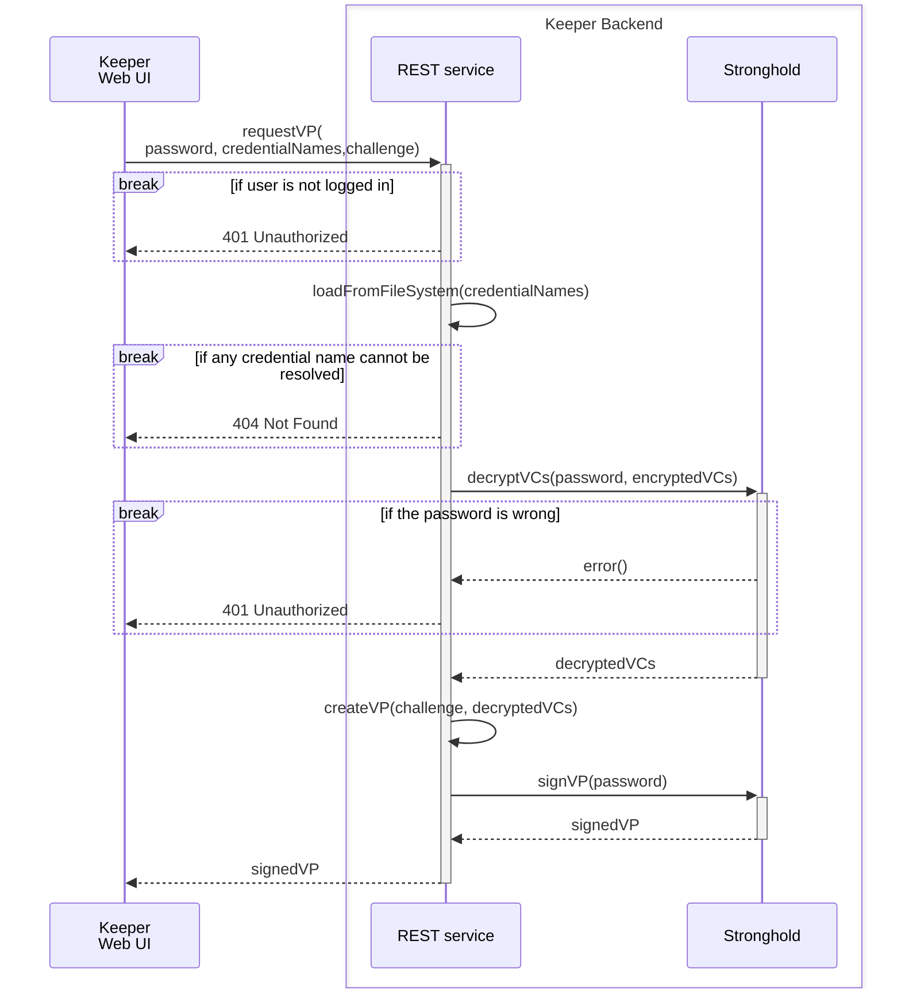

# Keeper Technical Design Document<!-- omit in toc -->

*Keeper* is a RESTful wallet for DIDs and Verifiable Credentials designed to run on consumer hardware, enabling third party software to securely interact with local DIDs or create Verifiable Presentations, just by providing a username and a password. It uses [IOTA Stronghold](https://wiki.iota.org/stronghold.rs/welcome/) under the hood, which handles a user's private keys with the highest security standards.

## Content <!-- omit in toc -->

- [1. Identity Creation](#1-identity-creation)
- [2. Identity Login](#2-identity-login)
- [3. Verifiable Credential Deposit](#3-verifiable-credential-deposit)
- [4. Verifiable Presentation Creation](#4-verifiable-presentation-creation)

<!-- TODO insert general architecture diagram here -->

# 1. Identity Creation

# 2. Identity Login

# 3. Verifiable Credential Deposit

# 4. Verifiable Presentation Creation

