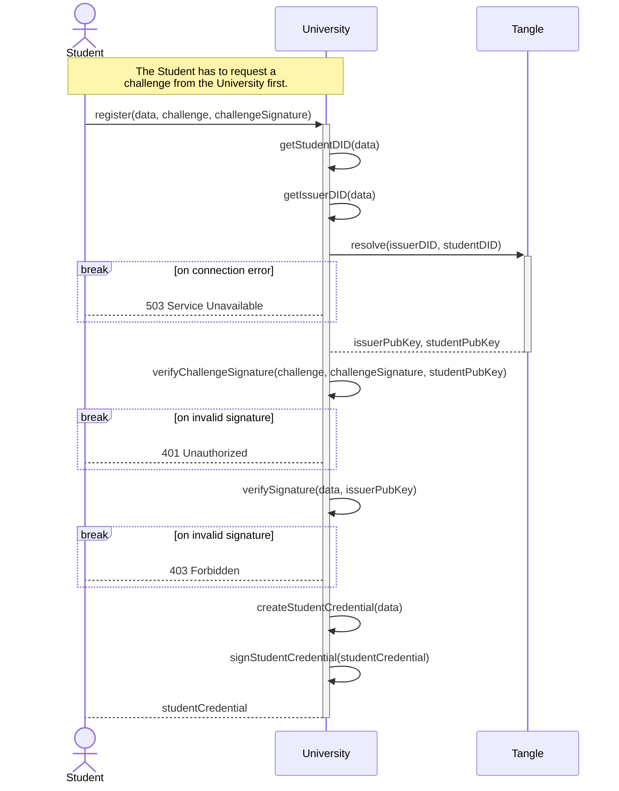
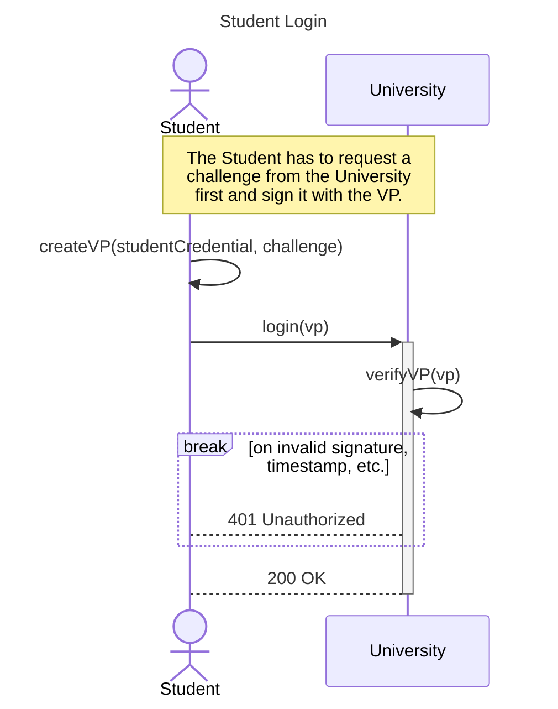

# Student Credential Issuance Service <!-- omit in toc -->


## Content <!-- omit in toc -->

- [1. Usage](#1-usage)
  - [1.1. Environment variables](#11-environment-variables)
- [2. Student Registration | Matriculation](#2-student-registration--matriculation)
- [3. Student Login](#3-student-login)

# 1. Usage

If you want to run your own development server, you'll need to create a `.env` file inside the `/backend` directory and fill it with your information.

Then, simply run

```shell
npm run dev
```

## 1.1. Environment variables

| Variable              | Default value     | Description                                                  |
| --------------------- | ----------------- | ------------------------------------------------------------ |
| `STRONGHOLD_PASS`     | `undefined`       | A password used to securely store the DID's secret key.      |
| `STRONGHOLD_PATH`     | `./identity.hodl` | Where the DID's secret key will be stored.                   |
| `INSTITUTION_DID`     | `undefined`       | An existing DID URL to use for your institution.             |
| `INSTITUTION_NAME`    | `undefined`       | Used to fill out the name in VCs issued by this DID.         |
| `INSTITUTION_WEBSITE` | `undefined`       | Used to fill out the homepage in VCs issued by this DID.     |
| `INSTITUTION_NETWORK` | `dev`             | The IOTA Tangle network to use.                              |
| `PRIMARY_NODE_URL`    | `undefined`       | The primary node URL used for operations on the Tangle.      |
| `NODE_ENV`            | `undefined`       | Set it to `development` to enable some debug console prints. |

# 2. Student Registration | Matriculation 



# 3. Student Login


